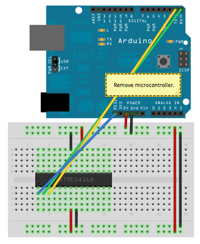

# Sensor with rf433 somunication possibilities

In  this project I will create sensor whitch will transmit its state (on/off) via rf433

## RF protocol

RF comunication protocol is explained here (https://www.itead.cc/wiki/images/5/5e/RF_Universal_Transeceive_Module_Serial_Protocol_v1.0.pdf)

This is sent from Arduino using RCSwitch library		
		
mySwitch.send("000000000001010100010001");		
		
These are couple of codes recieved with SonofRF, thay sligthly changes		
		
2A7601860406001511		
2A7601860406001511		
2A7601860406001511		
2A6C01860406001511		
2A6C018603FC001511		
		
This codes are in HEX and first 13 digits are not that constant but important part is last 6 digits and by that RF devices designate each other. The final 3 bytes are the code itself and it should be unique for every button in the same remote.		

| 00000000 | 00010101 | 00010001 | These are sent data from arduino      |
| -------- | -------- | -------- | ------------------------------------- |
| 00       | 15       | 11       | And this is how it decodes in SonofRF |

first 6 bytes is these (and constantly changinf)

2A  76  01  86  04  06

As per before mentioned documentation each two bites respresents Tsyn Tlow Thigh. I cant understand why they change with each transmition.

## Schematic

## Flashing Atmega328P

Flashing Atmega when it is on Arduno boar is easy, just plug it in PC and flash it using arduinoIDE or Arduino online IDE.

When it comes to flash Atmega so it could work as standalone on breadboard it a bit trickier. 

References:
* [Arduino on breadboard](https://www.arduino.cc/en/Tutorial/ArduinoToBreadboard) - Ways how to use and flash Atmega on breadboard
* [Download Arduino IDE](https://www.arduino.cc/en/Main/OldSoftwareReleases#previous) - Older versions of Arduino IDE can be downloaded here
* [Install additionl arduino cores/hardware](https://www.arduino.cc/en/guide/cores)
* [Programing with external programmer](https://www.arduino.cc/en/Hacking/Programmer)
* 

### Default Atmega flashing method (Minimal setup no external clock)
By default Atmega328 and others can be flashed using ICSP(in circuit serial programming). This is Atmel supported (hardware) way how to flash Atmega. Using this method you can flash any .hex file in to the microcontroler. for this task USB to .... can be used:
* USBASP
* Arduino as ISP (Arduino need to be programmed with Arduino ICS sketch for that)
* AVR ISP
* etc.

New chips are usualy delivered without any firmware preinstalled so it is clean and its is the only way to flasy any firmware to microcontroler.

For this project I used Arduino as ISP to flash bootloader. As I wanted to go with minimal setup without external clock, bootloader need to be installed specificaly for this setup, if microcontroler will be with default bootloader it will not work wothout external clock.

As per [this](https://www.arduino.cc/en/Tutorial/ArduinoToBreadboard) link bootloaders for minimal setup can be downloaded only for Arduino 1-6-x, 1-5-x, 1-0-x versions. I got errors trying to do it with 1-8-x. 

1. Zip file is downloaded and unziped in Arduino directory whitch you can find in:
    File > Preferences > Setings > Sketchbook location

2. Flash arduino with Arduino as ISP File > Examples>ArduinoISP. With this oneuse standart board Arduino Uno

3. When flashed chose new board showing in Tools > Board> "ATmega328 on a breadboard (8 MHz internal clock)"

4. Hook up Atmege to flash new minimal setup bootloader like this:

5. Chose programmer how bootloader will be flashed Tools > Programmer > Arduino as ISP

6. Flash bootloader to Atmega on breadbord

After doing these steps bootloader for minimal setup is installed and now microcontroler can be installed using arduino UART serial programming

### Arduino UART (tx rx ) programming

Microcontrollers are usually programmed through a programmer unless you have a piece of firmware in your microcontroller that allows installing new firmware without the need of an external programmer. This is called a bootloader.

> To burn the bootloader, you'll need to buy an [AVR-ISP](http://www.atmel.com/dyn/products/tools_card.asp?tool_id=2726) (in-system programmer), [USBtinyISP](http://www.ladyada.net/make/usbtinyisp/), build a [ParallelProgrammer](https://www.arduino.cc/en/Hacking/ParallelProgrammer). The programmer should be connected to the ICSP pins (the 2 by 3 pin header) - make sure you plug it in the right way. The board must be powered by an external power supply or the USB port.

When bootloader is in microcontroler, it can be programmed connecting by UART interface (pins 2 and 3)

Using arduino to program Atmega on breadboard, Atmega need to be removed from Arduino board and hook up arduino board to breadboard like this:

Now keeping "ATmega328 on a breadboard (8 MHz internal clock)" configuration microcontroler can be flashed.

Arduino board have on board USB to UART system. Alternatively any USB to UART board can be installed.

When microcontroler is in working circuit you can power it down hook up as mentioned before and reprogram it.

## Used libraries

* [<RCSwitch.h>](https://www.arduinolibraries.info/libraries/rc-switch)
* <avr/sleep.h> - built in avr library

## Sleeping

# References

* [Arduino 433 rf comunication turotial](https://dronebotworkshop.com/433mhz-rf-modules-arduino/)
* [RadioHead library](http://www.airspayce.com/mikem/arduino/RadioHead/)
* [SONOF rf decoding manual](https://www.itead.cc/wiki/images/5/5e/RF_Universal_Transeceive_Module_Serial_Protocol_v1.0.pdf)
* [SONOF RF hack ](http://tinkerman.cat/hacking-sonoff-rf-bridge-433/#lightbox-gallery-p5nMuj1w/12/)
* [ASH Transceiver Software Designer's Guide of 2002.08.07](https://wireless.murata.com/media/products/apnotes/tr_swg05.pdf?ref=rfm.com)
* [Future reading](http://web.engr.oregonstate.edu/~moon/research/files/cas2_mar_07_dpll.pdf) 
* [RadioHead ASK Documantation](https://www.airspayce.com/mikem/arduino/RadioHead/classRH__ASK.html#ad8fe587d5651b972ffe1b35b701305b8)
*  [Antena for 433 tutor](http://forum.elektor.com/download/file.php?id=2428034&sid=e5435be69d352a5ba6e669d3b676cd25)
* [RC switch library explained](https://github.com/sui77/rc-switch/wiki/HowTo_OperateLowCostOutlets) 
* [some explanation on whitch bites of rf code is actual data](https://github.com/xoseperez/espurna/issues/271)
* (http://tinkerman.cat/decoding-433mhz-rf-data-from-wireless-switches/)
* [evolution and explanation of WIFI](https://www.steute.de/fileadmin/Downloads/wireless/Kataloge/Wireless_book.pdf) 
* [RF comnication phisics and diferetn types](http://www.ti.com/lit/ml/slap127/slap127.pdf) - 
* [small post about RF protocols](http://tech.jolowe.se/home-automation-rf-protocols/) - 
* (https://1technophile.blogspot.com/2017/11/sonoff-rf-bridge-with-custom-firmware.html) - 
* [SonofRFB OpenMQTT Gateway](https://github.com/1technophile/OpenMQTTGateway/wiki/Sonoff-RFB) -
* [Arduino Sleep code](https://playground.arduino.cc/Learning/ArduinoSleepCode/) - Wake up arduino on interupt
* [Arduino minimal settup on breadbord](https://www.arduino.cc/en/Tutorial/ArduinoToBreadboard)

* https://coderwall.com/p/duapqq/use-a-google-spreadsheet-as-your-json-backend
